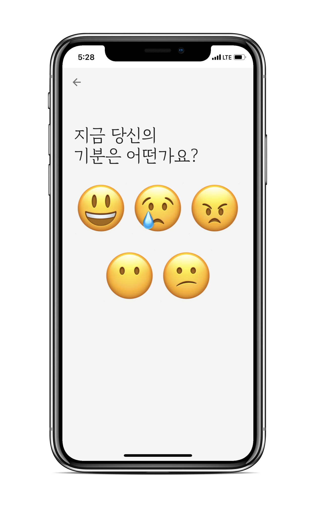
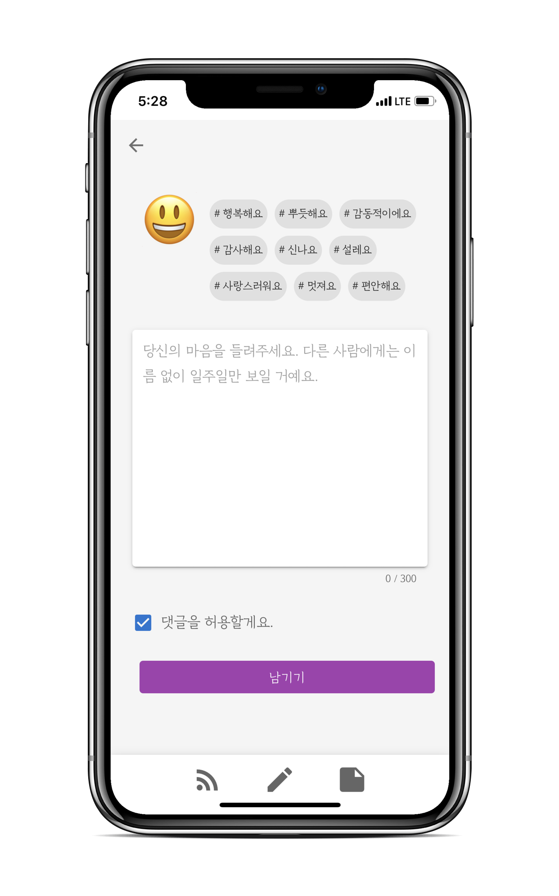
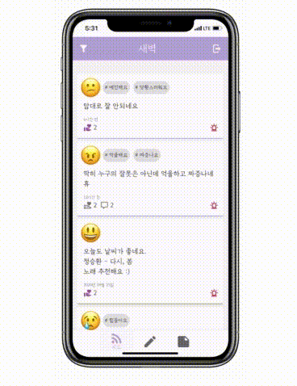
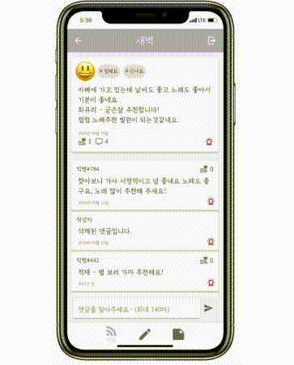
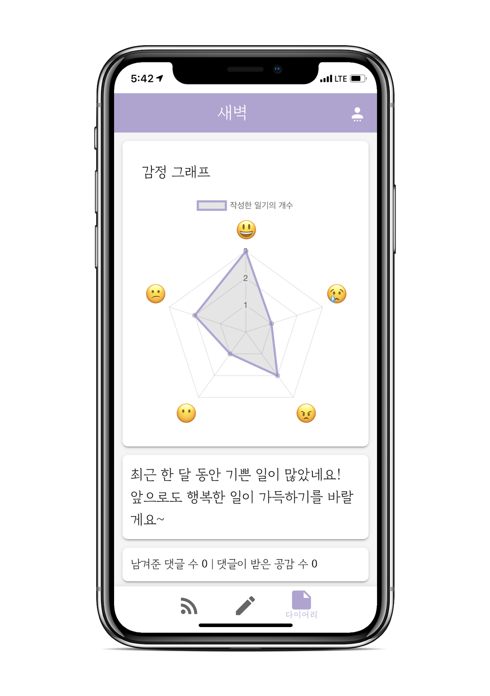

# 새벽 : 당신의 마음, 새벽이 들어줄게요

새벽은 감정 일기를 올리고, 서로 공감해줄 수 있는 익명 공유 다이어리에요.

## 서비스 소개

### 감정 태그를 활용해서 당신의 이야기를 들려주세요.

글을 작성할 때 다섯 가지의 큰 감정을 나타내는 이모지와

각 감정에 속하는 작은 감정 태그로 작성자의 마음을 쉽게 표현할 수 있어요.

또한 피드에서 필터를 사용해 보고 싶은 감정의 글만 볼 수도 있어요.  

### 이야기를 공유해보세요.

1주일이 지나면 나에게만 보여요.
새벽은 피드에 게시글을 7일 동안만 노출해요.

이후로는 게시글 작성자만 다이어리 페이지에서 확인할 수 있어요.

### 어떤 이야기도 괜찮아요.

새벽이 비밀을 지켜줄게요.
새벽은 사용자 식별을 위한 최소한의 정보 이외의 어떠한 정보도 수집하거나 표시하지 않아요.

### 공감과 댓글을 받을 수 있어요.

물론 줄 수도 있구요! 다른 사용자에게 공감과 댓글을 받을 수 있어요. 내가 받은 공감과 댓글의 개수도 확인할 수 있어요!

### 나만의 감정 다이어리를 채워보세요.

내가 쓴 글은 다이어리에 저장되고, 7일이 지나도 볼 수 있어요. 주로 어떤 감정의 글을 작성하였는지 통계도 볼 수 있어요.

## 기술 스택

## 팀 소개

### 팀 문화

1. 불통과 거리두기
2. 마음의 문을 열자
3. 자라나라 오글오글!
4. 나만 아는 보통은 보통이 아니다
5. 과정을 즐기자
6. 막상 해보면 별 거 아냐
     

### 👏칭찬합시다

매일 할 일을 마치고 팀원끼리 칭찬하는 시간을 가짐으로써평소 팀원에게 관심을 가지고, 서로 간에 이해와 친밀도를 높여 팀워크 향상을 도모하였습니다.

실제로 번아웃을 극복하고, 몰랐던 자신의 장점을 발견하는 데 큰 도움이 되었습니다.

**👉🏻**[보러가기](https://www.google.com/url?q=https%3A%2F%2Fwww.notion.so%2F5geul%2F8668e15a894d4145a7217eed27bb41c6%3Fv%3D1169569443e3450c936fb08c75b39179&sa=D&sntz=1&usg=AFQjCNFIct1A-pDaVGFRvXVO6I-9LUdRXg)

### 만든 사람들

|                                                               그래                                                                |                                                                쪼밀리                                                                |                                                              카프카                                                              |                                                              쿨라임                                                              |                                                                 히로                                                                  |
| :-------------------------------------------------------------------------------------------------------------------------------: | :----------------------------------------------------------------------------------------------------------------------------------: | :------------------------------------------------------------------------------------------------------------------------------: | :------------------------------------------------------------------------------------------------------------------------------: | :-----------------------------------------------------------------------------------------------------------------------------------: |
|                                                                                                       |                                                                                                        |                                                                                                    |                                                                                                    |                                                                                                           |
|                                                             🌋화산남                                                              |                                                               💡똑순이                                                               |                                                             🤖격려봇                                                             |                                                             🎤발표왕                                                             |                                                              📚히로위키                                                               |
|                                                          🏅베스트 리뷰어                                                          |                                                           👨‍👩‍👧‍👦팀문화 메이커                                                            |                                                         📖문서화 마스터                                                          |                                                         🔪커밋 슬라이서                                                          |                                                            👨‍💻인프라 마스터                                                            |
| [📌GitHub](https://www.google.com/url?q=https%3A%2F%2Fgithub.com%2Fhwanghe159&sa=D&sntz=1&usg=AFQjCNHqzJ2XIlC8roUL8deG_RBknKdAQw) | 📌[GitHub](https://www.google.com/url?q=https%3A%2F%2Fgithub.com%2FSujinEmilyCho&sa=D&sntz=1&usg=AFQjCNEyAXhA6N5XpKT0CRstfXh_epEG5w) | 📌[GitHub](https://www.google.com/url?q=https%3A%2F%2Fgithub.com%2Finclude42&sa=D&sntz=1&usg=AFQjCNGnYpHtUUXGIqPpqN3VtOnRQWg6zw) | 📌[GitHub](https://www.google.com/url?q=https%3A%2F%2Fgithub.com%2FicyMojito&sa=D&sntz=1&usg=AFQjCNEK68E0cQfAcIa5OPZMPgkqwJhb5A) | 📌[GitHub](https://www.google.com/url?q=https%3A%2F%2Fgithub.com%2Fhotheadfactory&sa=D&sntz=1&usg=AFQjCNFs4qbu1kDQPltE568HyUO9URB0EA) |

