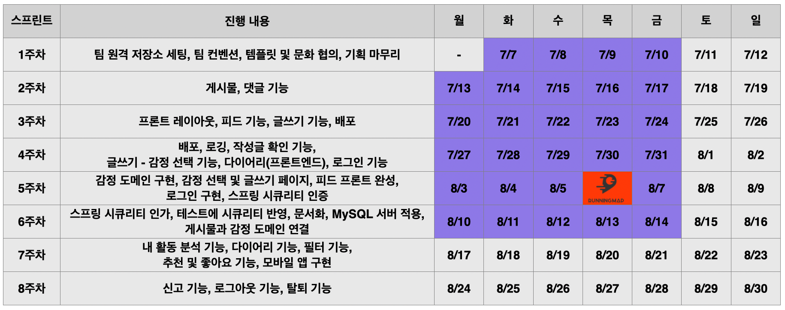

# 새벽 : 당신의 마음, 새벽이 들어줄게요

## 프로젝트 소개

### **주제**

새벽은 감정 일기를 올리고, 서로 공감해줄 수 있는 익명 공유 다이어리에요.

### **컨셉**

- 감정 태그를 활용해서 당신의 이야기를 들려주세요.
- 이야기를 공유해보세요. 1주일이 지나면 나에게만 보여요.
- 어떤 이야기도 괜찮아요. 새벽이 비밀을 지켜줄게요.
- 다른 새벽이에게 공감과 댓글도 받을 수 있어요. 물론 줄 수도 있구요!
- 나만의 감정 다이어리를 채워보세요.

### 기술 스택

## 팀 소개

### 만든 사람들

[그래](https://github.com/hwanghe159)
/ [쪼밀리](https://github.com/SujinEmilyCho) 
/ [카프카](https://github.com/include42) 
/ [쿨라임](https://github.com/icyMojito)
/ [히로](https://github.com/hotheadfactory)

### 팀 문화

1. 불통과 거리두기
2. 마음의 문을 열자 
3. 자라나라 오글오글!
4. 나만 아는 보통은 보통이 아니다
5. 과정을 즐기자
6. 막상 해보면 별 거 아냐

## 진행상황

